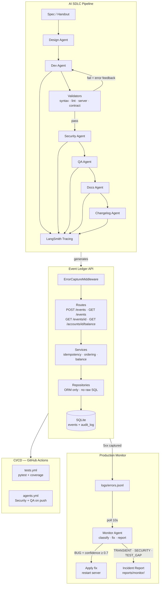

# Architecture

## System Diagram



---

## System Overview

The complete solution has three distinct layers. The agents build the app — the app serves the API — CI runs the agents automatically on every push — the Monitor Agent watches prod and self-heals.

```
┌─────────────────────────────────────────────────────────────────┐
│                  AI SDLC PIPELINE (dev + prod layer)            │
│                                                                 │
│  ai_sdlc/prompts/  (versioned prompt files)                     │
│       │                                                         │
│       ▼                                                         │
│  Design Agent ──► Dev Agent ──► Security Agent                  │
│                      │              │                           │
│                  Validators         │                           │
│                  (syntax, lint,     │                           │
│                  server, contract)  │                           │
│                      │              │                           │
│               Self-healing       QA Agent ──► Docs Agent        │
│               loop (3 retries)      │            │              │
│                                     │       Changelog Agent     │
│                              LangSmith trace                    │
│                                                                 │
│  Monitor Agent (production)                                     │
│  └── watches logs/errors.jsonl                                  │
│      classifies → fixes → restarts server                       │
└─────────────────────────────────────────────────────────────────┘
                              │ generates
                              ▼
┌─────────────────────────────────────────────────────────────────┐
│                    EVENT LEDGER API (application layer)         │
│                                                                 │
│   POST /events          GET /events/{id}                        │
│   GET /events?account=  GET /accounts/{id}/balance              │
│   GET /health                                                   │
│                                                                 │
│  ┌──────────────────────────────────────────────────────────┐   │
│  │  Routes  →  Services  →  Repositories                    │   │
│  │                 │                                        │   │
│  │  ErrorCaptureMiddleware → logs/errors.jsonl              │   │
│  │  Structured logging (JSON)                               │   │
│  │  Global exception handler                                │   │
│  └──────────────────────────┬───────────────────────────────┘   │
│                             │                                   │
│                    ┌────────▼────────┐                          │
│                    │ SQLite database │                          │
│                    │  events table   │  ← immutable event log   │
│                    │  audit_log table│  ← every API call logged │
│                    └─────────────────┘                          │
└─────────────────────────────────────────────────────────────────┘
                              │
┌─────────────────────────────────────────────────────────────────┐
│                    CI/CD (GitHub Actions)                       │
│                                                                 │
│   on: push                                                      │
│   ├── tests.yml    → pytest + coverage report                   │
│   └── agents.yml   → Security Agent + QA Agent auto-run         │
└─────────────────────────────────────────────────────────────────┘
```

---

## Application Layer — Components

| File | Purpose |
|---|---|
| `app/main.py` | FastAPI app, middleware, startup, global exception handler |
| `app/middleware/error_capture.py` | Captures 5xx events to logs/errors.jsonl for Monitor Agent |
| `app/core/database.py` | SQLite engine, session factory, table initialisation |
| `app/core/logging_config.py` | Structured JSON logger used across all layers |
| `app/core/exceptions.py` | Domain exceptions — `EventNotFoundError`, `AccountNotFoundError` |
| `app/models/orm.py` | `Event` + `AuditLog` SQLModel tables — `Decimal` + `Numeric(18,8)` for amounts |
| `app/models/schemas.py` | Pydantic v2 request/response shapes |
| `app/repositories/event_repo.py` | All DB access — ORM only, no raw SQL |
| `app/services/event_service.py` | Business logic — idempotency, balance, ordering |
| `app/routes/events.py` | `POST /events`, `GET /events/{id}`, `GET /events` |
| `app/routes/accounts.py` | `GET /accounts/{id}/balance` |

---

## AI SDLC Layer — Agents

| Agent | Input | Output |
|---|---|---|
| Design Agent | Spec document | `docs/architecture.md` — Mermaid diagram + design summary |
| Dev Agent | Spec + architecture doc | Full application code in `app/` |
| Security Agent | Generated `app/` code | `reports/security-review.md` |
| QA Agent | Generated `app/` code | `tests/` + `reports/coverage.md` + `reports/functional.md` |
| Docs Agent | Live `/openapi.json` from running app | `docs/api-guide.md` |
| Changelog Agent | Git log | `CHANGELOG.md` |
| Monitor Agent | `logs/errors.jsonl` + affected source files | Fixed source file + `reports/monitor/incident-*.md` |

---

## Validator Layer — Anti-Hallucination

Validators run after every Dev Agent output. They execute — not read — the generated code.

| Validator | Executes | Catches |
|---|---|---|
| `SyntaxValidator` | `py_compile.compile()` | Syntax errors |
| `LintValidator` | `ruff check` via subprocess | Undefined names, bad imports |
| `ServerValidator` | uvicorn subprocess + httpx `/health` | Startup crashes |
| `ContractValidator` | httpx hitting all 4 endpoints | Wrong status codes, missing fields |

If any validator fails — specific error fed back to Dev Agent — retry up to 3 times — if still failing, pipeline stops for human review.

---

## Data Flow — How an Event Moves Through the System

```
Client POST /events
       │
       ▼
  ErrorCaptureMiddleware (wraps all requests)
       │
       ▼
  Pydantic v2 validates payload
  ├── invalid → 422 Unprocessable Entity (structured error, no stack trace)
  └── valid   ──►
                  AuditLog entry written
                  (endpoint, timestamp, account_id, outcome)
                       │
                       ▼
                  eventId lookup
                  ├── exists → return original event, 200 OK  (idempotent)
                  └── new    → INSERT Event row, 201 Created
                                    │
                                    ▼
                             Balance computed live on read
                             SUM(CREDIT) - SUM(DEBIT)
                             ORDER BY eventTimestamp ASC
                             (out-of-order safe — arrival order irrelevant)

  If 5xx occurs at any point:
       │
       ▼
  ErrorCaptureMiddleware writes to logs/errors.jsonl
       │
       ▼
  Monitor Agent (polling every 10s)
  ├── TRANSIENT → log incident report, no code change
  ├── SECURITY  → log finding in reports/monitor/
  ├── TEST_GAP  → log finding in reports/monitor/
  └── BUG       → apply fix to source file → restart server
```

---

## File Structure

```
event-ledger/
│
├── app/                            # Production FastAPI service
│   ├── main.py
│   ├── middleware/
│   │   └── error_capture.py        # feeds Monitor Agent
│   ├── core/
│   │   ├── database.py
│   │   ├── logging_config.py
│   │   └── exceptions.py
│   ├── models/
│   │   ├── orm.py
│   │   └── schemas.py
│   ├── repositories/
│   │   └── event_repo.py
│   ├── services/
│   │   └── event_service.py
│   └── routes/
│       ├── events.py
│       └── accounts.py
│
├── ai_sdlc/                        # AI-augmented SDLC pipeline
│   ├── agents/                     # LangChain agents
│   │   ├── pipeline.py             # full pipeline orchestrator
│   │   ├── design_agent.py
│   │   ├── dev_agent.py
│   │   ├── security_agent.py
│   │   ├── qa_agent.py
│   │   ├── docs_agent.py
│   │   ├── changelog_agent.py
│   │   ├── monitor_agent.py        # production self-healing agent
│   │   ├── guardrails.py
│   │   ├── evals.py
│   │   └── client.py
│   ├── validators/                 # anti-hallucination validators
│   │   ├── syntax_validator.py
│   │   ├── lint_validator.py
│   │   ├── server_validator.py
│   │   └── contract_validator.py
│   ├── prompts/                    # versioned prompt files
│   │   ├── design_agent.md
│   │   ├── dev_agent_core.md
│   │   ├── dev_agent_models.md
│   │   ├── dev_agent_repositories.md
│   │   ├── dev_agent_services.md
│   │   ├── dev_agent_routes.md
│   │   ├── dev_agent_main.md
│   │   ├── security_agent.md
│   │   ├── qa_agent.md
│   │   ├── docs_agent.md
│   │   ├── changelog_agent.md
│   │   └── monitor_agent.md
│   └── runners/                    # phase runners + monitor
│       ├── run_phase2.py           # Design Agent
│       ├── run_phase3.py           # Dev Agent (core, models, repos)
│       ├── run_phase4.py           # Dev Agent (services, routes, main)
│       ├── run_phase5.py           # Security Agent
│       ├── run_phase6.py           # QA Agent
│       ├── run_phase7.py           # Docs + Changelog Agents
│       └── run_monitor.py          # Production Monitor
│
├── tests/                          # generated by QA Agent — 93% coverage
├── docs/                           # design docs + generated guides
├── reports/                        # generated by Security + QA + Monitor agents
│
├── .github/
│   └── workflows/
│       ├── tests.yml               # pytest + coverage on every push
│       └── agents.yml              # Security + QA agents on every push
│
├── mcp_server.py                   # MCP server — exposes API as AI-callable tools
├── Dockerfile
├── docker-compose.yml
├── scripts/
│   ├── start.sh                    # auto-install deps + start (Linux/Mac)
│   └── start.ps1                   # auto-install deps + start (Windows)
├── pyproject.toml
└── README.md
```
